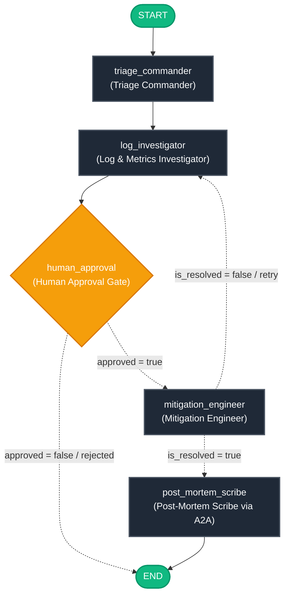
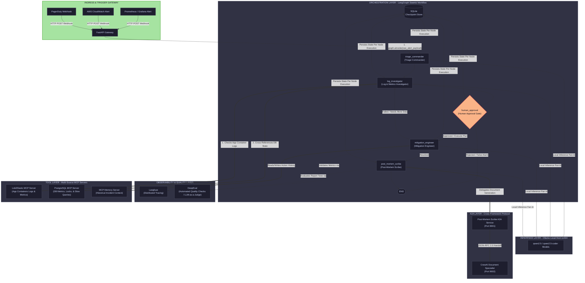

# Automated Infrastructure And Post-Mortem Engine
---
## The LangGraph Flow

---
## The Complete System Architecture

**Agent 1:** Triage Commander (triage_commander) – Structure raw data, handles noisy payload ingestion and configures state routing.

**Agent 2:** Log & Metrics Investigator (log_investigator) – The diagnostic hunter. Loops through tools to isolate root causes.

**Agent 3:** Mitigation Engineer (mitigation_engineer) – Proposes/applies safe state fixes and checks performance recoveries against metrics targets.

**Agent 4:** Post-Mortem Scribe Client (post_mortem_scribe) – Captures final graph states and commands the cross-framework translation.

**Agent 5:** CrewAI Document Specialist (External) – Hosted as a microservice, specialized purely in writing readable, long-form post-mortem compliance reports using distinct framework capabilities.

### Key Architecture Connections
**MCP Integration:** The Tool Layer now houses separate MCP servers (Loki/Elastic MCP for application workloads, and a PostgreSQL MCP for direct database analysis). This enables the *log_investigator* to systematically step through the application logs, discover a DB timeout, and seamlessly query the database engine next

**A2A Delegation:** The *post_mortem_scribe* node acts as an A2A Client. It passes execution arrays over local JSON-RPC endpoints to the CrewAI framework service, allowing completely seamless cross-framework processing without tying CrewAI directly into your LangGraph engine.

**Quality & Observability Isolation:** Every single execution step, node switch, and model query automatically drops trace hooks down to Langfuse. When code adjustments or generated documentation reports wrap up, DeepEval steps in as an isolated asynchronous evaluator to run deterministic semantic validations against the output before completing the cycle.

---

## Technology stack
| Technology | Version | Role |
|------------|---------|------|
| LangGraph | 1.1.0 | Stateful multi-agent graph orchestration |
| MCP | 1.26.0 | Standardized agent-to-tool protocol |
| A2A SDK | 0.3.25 | Cross-framework agent-to-agent protocol |
| Ollama | latest | Local LLM inference (no API keys) |
| CrewAI | 1.13.0 | Cross-framework interop via A2A |
| Langfuse | 4.0.1 | Distributed tracing and observability |
| DeepEval | 3.9.1 | LLM-as-judge evaluation |

---

## Hardware Requirements
| Setup | RAM | VRAM | Model | Notes |
|--------|-----|------|-------|-------|
| Minimum | 16 GB | 8 GB | qwen2.5:7b | Fully functional |
| Recommended | 32 GB | 24 GB | qwen2.5-coder:32b | Best tool-calling reliability |
| CPU-only | 32 GB | None | qwen2.5:7b | Works but 5 to 10 times slower |

---

